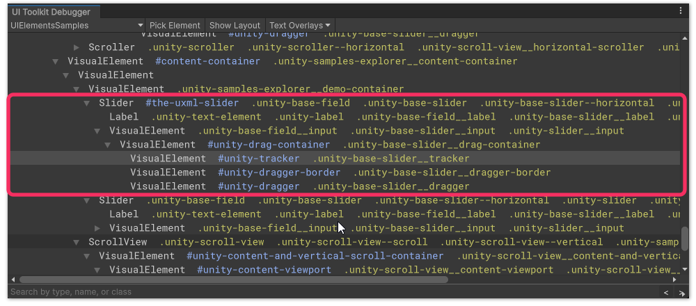
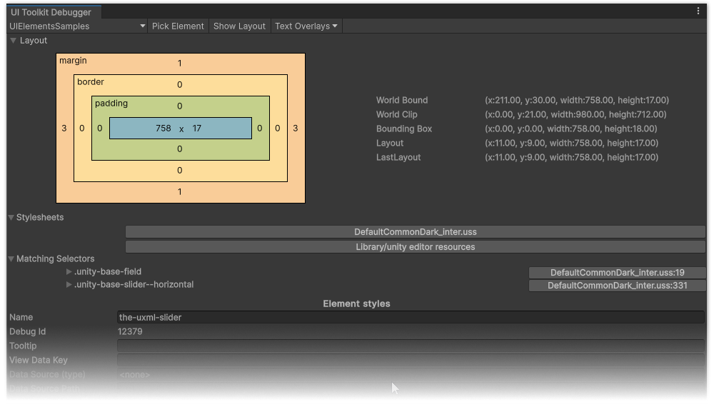
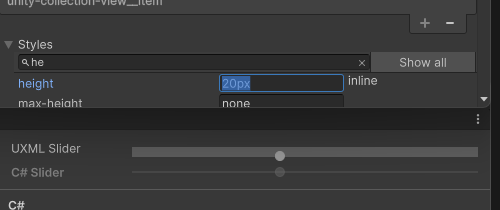

# UI Toolkit Debugger
Use the [UI Toolkit Debugger](https://docs.unity3d.com/Manual/UIE-ui-debugger.html) to inspect the styles, types, names, classes, and hierarchy of your element. If you've used browser dev tools this should be familiar to you.

You can find the debugger at **Window | UI Toolkit | Debugger** or **Window | Analysis | UIElements Debugger** depending on Unity version; right-click on an inspector tab and select it, or press <kbd>Ctrl+F5</kbd>.

## Inspecting your element
Select the correct window from the top left of the debugger, and select **Pick Element**. Hover your element until the portion you wish to work with is highlighted, and select it.

:::error
Don't inspect elements directly in the [UI Builder](https://docs.unity3d.com/Manual/UIBuilder.html) for styling.  
The UI Builder adds extra elements for resizing and highlighting that will not be present in the final UI.
:::

^^^
<video width="750" height="325" loop muted controls><source type="video/webm" src="/HTML/ui/ui-toolkit/ui-toolkit-debugger-picking.webm"></video>
^^^ Picking the background sliding bar of the Slider.

## The hierarchy
{.padded}

Now the element has been selected (or something close to it), you can see a hierarchy of all the elements it's made of, their names, and their classes. The text in the hierarchy follows the [selector rules](#learn-selector-rules) we learned earlier.

You can hover over the elements, which will be highlighted in the window you are inspecting.

## The inspector
{.padded}

Here you can see the layout, stylesheets and the order they are applied, matched selectors and their precedence, state, applied classes, styles and how they are matched, and a dump of the UXML.

## Preview style adjustments of your elements
In the **Styles** foldout you can override any style temporarily for the element (reload the window or reset its content to reset it).

^^^  
  
^^^ Directly adjusting the height of the example slider.

Adjust the styles of your element, and surrounding elements under the control until you are happy with the outcome.

:::warning
These adjustments are temporary, note down what adjustments you have made, or perform the next step in parallel.
:::
