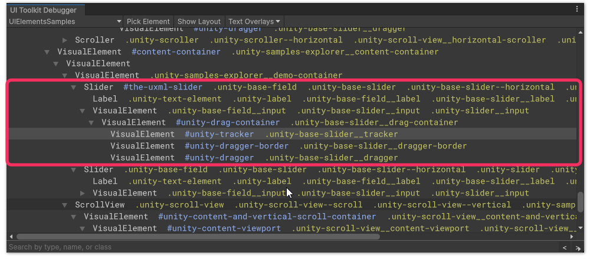
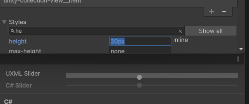

# UI Toolkit debugging
- [UI Toolkit Debugger](#ui-toolkit-debugger)
- [UI Toolkit Event Debugger](#ui-toolkit-event-debugger)
- [Performance debugging](#performance-debugging)

## UI Toolkit Debugger
You can use the [UI Toolkit Debugger](https://docs.unity3d.com/Manual/UIE-ui-debugger.html) to inspect the styles, types, names, classes, and hierarchy of your element. If you've used browser dev tools this should be familiar to you.

You can find the debugger at **Window | UI Toolkit | Debugger** or **Window | Analysis | UIElements Debugger** depending on Unity version; right-click on an inspector tab and select it, or press <kbd>Ctrl+F5</kbd>.

### Inspecting your element
Select the correct window from the top left of the debugger, and select **Pick Element**. Hover your element until the portion you wish to work with is highlighted, and select it.

:::error
Don't inspect elements directly in the [UI Builder](https://docs.unity3d.com/Manual/UIBuilder.html) for styling.  
The UI Builder adds extra elements for resizing and highlighting that will not be present in the final UI.
:::

^^^
<video width="750" height="325" loop muted controls><source type="video/webm" src="/HTML/ui/ui-toolkit/ui-toolkit-debugger-picking.webm"></video>
^^^ Picking the background sliding bar of the Slider.

### The hierarchy
{.padded}

Now the element has been selected (or something close to it), you can see a hierarchy of all the elements it's made of, their names, and their classes. The text in the hierarchy follows the [selector rules](#learn-selector-rules) we learned earlier.

You can hover over the elements, which will be highlighted in the window you are inspecting.

### The inspector
{.padded}

Here you can see the layout, stylesheets and the order they are applied, matched selectors and their precedence, state, applied classes, styles and how they are matched, and a dump of the UXML.

### Preview style adjustments of your elements
In the **Styles** foldout you can override any style temporarily for the element (reload the window or reset its content to reset it).

^^^  
  
^^^ Directly adjusting the height of the example slider.

Adjust the styles of your element, and surrounding elements under the control until you are happy with the outcome.

:::warning
These adjustments are temporary, note down what adjustments you have made, or perform the next step in parallel.
:::

## UI Toolkit Event Debugger
The UI Toolkit Events Debugger (**Window | UI Toolkit | Event Debugger**) can help debug issues with element interactions.  

:::info{.small}  
If the menu item is not present, enable the debugger in **Edit | Project Settings | UI Toolkit | Enable Event Debugger**.
:::

## Performance debugging

Use [`PanelSettings.SetPanelChangeReceiver`](https://docs.unity3d.com/6000.0/Documentation/ScriptReference/UIElements.PanelSettings.SetPanelChangeReceiver.html) to receive every change event. Comparing the timing of events with captures from the [Profiler](../Debugging/Performance%20Profiling.md) you can get a good picture of what change is causing hitches.

### Common performance pitfalls
- Adding or removing a class on an element with many children.
  - In this case, prefer using inline styles where possible.
- Using nested masks.
  - Apply [`UsageHint.MaskContainer`](https://docs.unity3d.com/ScriptReference/UIElements.UsageHints.MaskContainer.html) on the root of the mask to reset batching.
- Moving an element frequently.
  - Apply [`UsageHint.DynamicTransform`](https://docs.unity3d.com/ScriptReference/UIElements.UsageHints.DynamicTransform.html) so transform calculations are performed on the GPU.
- Moving an element and its children frequently.
  - Apply [`UsageHint.GroupTransform`](https://docs.unity3d.com/ScriptReference/UIElements.UsageHints.GroupTransform.html) and [`UsageHint.DynamicTransform`](https://docs.unity3d.com/ScriptReference/UIElements.UsageHints.DynamicTransform.html) to its children.
- Using more than 7 unique textures in one UI area.
  - Use a [Sprite Atlas](https://docs.unity3d.com/Manual/class-SpriteAtlas.html) to group your textures as one.
  - Configure the [Dynamic Atlas Settings](https://docs.unity3d.com/Manual/UIE-Runtime-Panel-Settings.html) on the Panel Settings asset to better encompass your textures.
- Abusing frequently-called events like `GeometryChangedEvent`.

### See also
- [Getting the best performance with UI Toolkit | Unite 2024](https://www.youtube.com/watch?v=bECmaYIvZJg)
