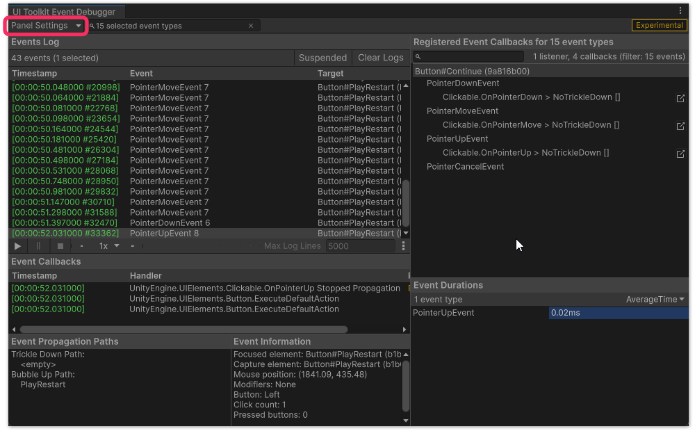

## Input issues: UI Toolkit
Input in UI Toolkit requires multiple things to receive input events.  
:::warning
Don't make assumptions. Double-checking these steps are met is always recommended.
:::

:::note
#### 1. Check for an Event System
There must be an **active [EventSystem](https://docs.unity3d.com/Packages/com.unity.ugui@latest/index.html?subfolder=/manual/EventSystem.html)** in the Scene. You can create one via **GameObject | UI | Event System**.  
:::

:::note
#### 2. Check your element is pickable
Interactable elements must have **Picking Mode** set to **Position**.  
:::

::::note
#### 3. Check for overlapping elements
There mustn't be other elements receiving the same events below in the hierarchy.    
Visual Elements have **Picking Mode** enabled by default, this will block events. I advise setting it to **Ignore** for all non-blocking elements.

#### Troubleshooting overlaps
To troubleshoot cases where other UI is blocking input, use the Event Debugger (**Window | UI Toolkit | Event Debugger**).  
:::info{.small}  
If the menu item is not present, enable the debugger in **Edit | Project Settings | UI Toolkit | Enable Event Debugger**.
:::

Make sure you have selected your target panel (**not** "GameView" if you're using runtime UI) in the top-left dropdown.

{.padded}

::::

:::note
#### 4. Check this other miscellaneous nonsense
- If you're using the Input System package, it is required to be version `1.1.0-pre.5` or above.  

:::