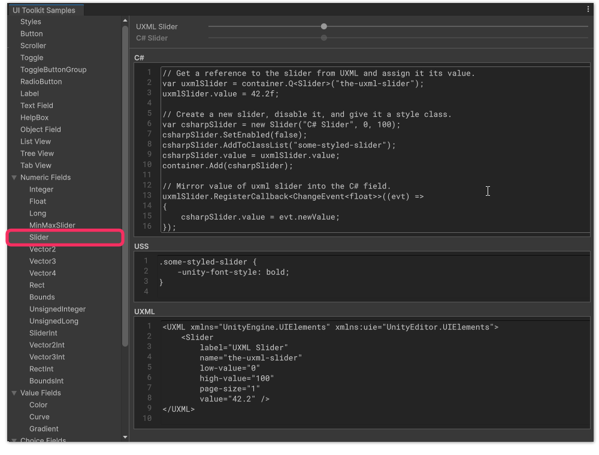
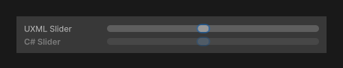

# Styling elements in UI Toolkit

This guide describes how to create USS selectors to style complex elements.  

USS is a query system similar to CSS that allows you to construct rules to constrain styling to specific elements.  

::::note
### Steps taken when styling an element
- [Create your element](#create-your-element)
- [Learn USS selectors.](Selectors.md)
    - Learn selector rules to target classes on elements across the hierarchy.
    - Understand USS precedence.
- [Learn to use the UI Toolkit Debugger.](Debugger.md)
    + Preview style adjustments of your elements.
- [Construct a USS rule that targets your element.](#construct-a-uss-rule)

### Additionally
- [Take a peek at the C# source code that actually constructed your control.](#take-a-peek-at-the-c-source-code)

::::

## Create your element
We actually need to see an element to see how to style it. Create an element using the UI Builder, UXML, or via code.

### Avoid inline styles
Style overrides in the UI Builder or UXML's style property should be avoided.

Inline styles override all other styling and must be specified every time an element is created.
These styles are generally only appropriate when setting dynamic behaviour in code.

### Use BEM when choosing class names
[Block Element Modifier](https://getbem.com) (BEM) is a naming convention that is also used by UI Toolkit[^1]. You can remain consistent with the built-in controls, and keep consistency with others by using it too.

::::note
### Example
For our styling example we will be styling a Slider. The example will use one from the UI Toolkit Samples **Window | UI Toolkit | Samples**.

{.padded}

::::

## Learn USS selectors.
See [USS selectors.](Selectors.md)

## Learn to use the UI Toolkit Debugger.
See [UI Toolkit Debugger](Debugger.md)

## Construct a USS rule
### Use selectors to target your element
In your USS, reconstruct the work you have done in the debugger.  
Often, you should anchor the styling to the root of the control, using the type, its name, or class. Take note of the preexisting **Matching Selectors** already present on your element for inspiration.

^^^  
  
^^^ A preexisting selector that has been used by UI Toolkit for our element.

### Use properties to style your selector's matches
Once you've created a selector, use [USS properties](https://docs.unity3d.com/Manual/UIE-uss-properties.html) to style the elements it matches. Learning USS properties and syntax is beyond the scope of this guide, but note it has great similarity with CSS if you ever get lost with a certain style.  
:::info
The [USS property data types](https://docs.unity3d.com/Manual/UIE-USS-PropertyTypes.html) page is a specification applying to the [USS common properties](https://docs.unity3d.com/Manual/UIE-USS-SupportedProperties.html) page.  
Apply the listed syntax rules to formulate a valid property.
:::

::::note
### Example
^^^  
```css
.unity-base-slider__drag-container {
  /* Make the parent "drag container" align its "dragger" child in the center of the cross-axis */
  justify-content: center;
}

.unity-base-slider--horizontal .unity-base-slider__tracker {
  /* The "tracker" background can stretch across the slider (left 0 to right 0), 
     and not contribute to layout by using absolute. */
  position: absolute;
  height: 10px;
  top: auto;
  left: 0;
  right: 0;
  /* Set the radius to match the "dragger" */
  border-radius: 5px;
}

.unity-base-slider--horizontal .unity-base-slider__dragger {
  /* Make the "dragger" taller and remove previous alignment now it's centered */
  margin-top: 0;
  width: 16px;
}

.unity-base-slider--horizontal .unity-base-slider__dragger-border {
  /* Adjust the "dragger-border" to accomodate the new size of the "dragger". It's already absolute. */
  height: 14px;
  width: 20px;
  margin-left: -2px;
}

/* Collapsable: Or, targeting the specific slider by name */
/* Targeting the specific slider by name: */
#the-uxml-slider .unity-base-slider__drag-container {
  /* Make the parent "drag container" align its "dragger" child in the center of the cross-axis */
  justify-content: center;
}

#the-uxml-slider.unity-base-slider--horizontal .unity-base-slider__tracker {
  /* The "tracker" background can stretch across the slider (left 0 to right 0), 
     and not contribute to layout by using absolute. */
  position: absolute;
  height: 10px;
  top: auto;
  left: 0;
  right: 0;
  /* Set the radius to match the "dragger" */
  border-radius: 5px;
}

#the-uxml-slider.unity-base-slider--horizontal .unity-base-slider__dragger {
  /* Make the "dragger" taller and remove previous alignment now it's centered */
  margin-top: 0;
  width: 16px;
}

#the-uxml-slider.unity-base-slider--horizontal .unity-base-slider__dragger-border {
  /* Adjust the "dragger-border" to accomodate the new size of the "dragger". It's already absolute. */
  height: 14px;
  width: 20px;
  margin-left: -2px;
}

/* End Collapsable */
```
^^^ Making a thicker slider via USS.

^^^  
  
^^^ Thicker slider created by the above USS.  
::::


### Styling notes
- Make careful adjustments to the combination of selectors you use to not override the styles of other elements that might use the classes.  
  If you see unwanted elements changing due to your style sheet, you will have to construct a more specific selector.
- I find the complicated part about USS is not the selectors, but the layout, and ramifications of layout in the hierarchy.  
  It can be tough to form an intuition about what styles across which elements will make the change you want to see. It just takes time.
- Try to reduce the amount of overrides you have. The simpler you can achieve an outcome, the easier it will be to modify it and not make a mess in the process.  
  Understand the primary and secondary axes (main and cross), and what flex and justification rules apply to them, and don't overdo it.
- [JetBrains Rider](https://www.jetbrains.com/rider/) supports USS syntax, if you have access to it I highly recommend it.
- [USS variables](https://docs.unity3d.com/Manual/UIE-USS-CustomProperties.html) can help solve tricky problems and avoid complex selectors.


## Take a peek at the C# source code
It's generally good practice to take a look at the [Unity C# reference source code](https://github.com/Unity-Technologies/UnityCsReference/) to see how something works. I keep a local copy to browse as I work.

In my example, I've been working with a Slider, searching for it in the `UIElements` namespace you can find [the file](https://github.com/Unity-Technologies/UnityCsReference/blob/67d5d85abbea076e469a1642e04f3ab50a326bea/Modules/UIElements/Core/Controls/Slider.cs) **Modules | UIElements | Core | Controls | Slider.cs**.  

Taking a look at how it's constructed, it uses a base class to do most of the work, but we can see it adds a class to the element, and uses properties to create some nested elements, adding classes to them too.  
^^^  
```csharp
/// <summary>
/// Creates a new instance of a Slider.
/// </summary>
/// <param name="label">The string representing the label that will appear beside the field.</param>
/// <param name="start">The minimum value that the slider encodes.</param>
/// <param name="end">The maximum value that the slider encodes.</param>
/// <param name="direction">The direction of the slider (Horizontal or Vertical).</param>
/// <param name="pageSize">A generic page size used to change the value when clicking in the slider.</param>
public Slider(string label, float start = 0, float end = kDefaultHighValue, SliderDirection direction = SliderDirection.Horizontal, float pageSize = kDefaultPageSize)
    : base(label, start, end, direction, pageSize)
{
    AddToClassList(ussClassName);
    labelElement.AddToClassList(labelUssClassName);
    visualInput.AddToClassList(inputUssClassName);
}
```
^^^ One of the constructors for a Slider

These classes are `public` and `static`, so if you're ever needing them in C# you can access them directly from the class!

^^^
```csharp
/// <summary>
/// USS class name of elements of this type.
/// </summary>
public new static readonly string ussClassName = "unity-slider";
/// <summary>
/// USS class name of labels in elements of this type.
/// </summary>
public new static readonly string labelUssClassName = ussClassName + "__label";
/// <summary>
/// USS class name of input elements in elements of this type.
/// </summary>
public new static readonly string inputUssClassName = ussClassName + "__input";
```
^^^ The classes applied to Slider as specified in C#.

You can investigate further, look at the base class `BaseSlider`, follow along to find out what elements it creates and what classes it adds. As most of UI Toolkit is in C#, and doesn't rely on UnityEngine.Object, most of the work is done in constructors and should be very intuitive!  

### Inline styles
Inline styles are indicated in the debugger. As mentioned previously, inline styles cannot be overridden by USS.
In these cases you will have to override the style in code, know you can poke around the source code to see why and how something has been done.

### Complex styles
Sometimes you might find a style isn't one of the [common USS properties](https://docs.unity3d.com/Manual/UIE-USS-Properties-Reference.html), and is instead implemented by [`CustomStyleProperty`](https://docs.unity3d.com/ScriptReference/UIElements.CustomStyleProperty_1.html).  
A great example of this is `CurveField`, where the curve color is driven by a `CustomStyleProperty<Color>` called [`--unity-curve-color`](https://github.com/Unity-Technologies/UnityCsReference/blob/67d5d85abbea076e469a1642e04f3ab50a326bea/Editor/Mono/UIElements/Controls/CurveField.cs#L60), your USS can use this property[^2].

[^1]: [Best practices for USS.](https://docs.unity3d.com/Manual/UIE-USS-WritingStyleSheets.html)
[^2]: To override a custom style in code, find what member the custom style is written to (`m_CurveColor` in this case), and write to it in a [`CustomStyleResolvedEvent`](https://docs.unity3d.com/ScriptReference/UIElements.CustomStyleResolvedEvent.html) callback.
