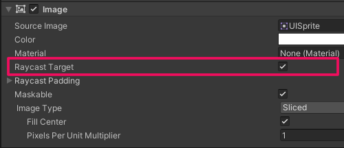
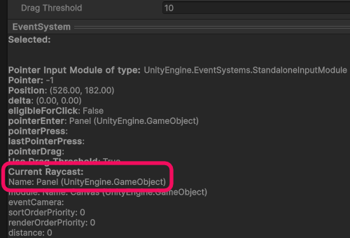

## Input issues: uGUI
Input in Unity UI (uGUI) requires multiple things to receive input events.  
:::warning
Do not make assumptions. Double-checking these steps are met is always recommended.
:::

:::note  
#### 1. Check for an Event System
There must be an **active [EventSystem](https://docs.unity3d.com/Packages/com.unity.ugui@latest/index.html?subfolder=/manual/EventSystem.html)** in the Scene. You can create one via **GameObject | UI | Event System**
:::

:::note  
#### 2. Check your Canvases and Groups
- A **[Graphic Raycaster](https://docs.unity3d.com/Packages/com.unity.ugui@latest/index.html?subfolder=/manual/script-GraphicRaycaster.html)** must be present on the Canvas and sub-Canvases above the element.
- **[Canvas Groups](https://docs.unity3d.com/Packages/com.unity.ugui@latest/index.html?subfolder=/manual/class-CanvasGroup.html)** above the element must be marked **Interactable**.

:::
:::note  
#### 3. Check your target element
- **Raycast target** must be enabled on the Graphic (Image for example) attached to a the element that receives input (such as Button).  

- If clicking a Button, it should be marked as **interactable**.
- You have actually registered the events you may be listening for.

:::

::::note  
#### 4. Check for overlapping elements
:::info{.inline}
Overlapping panels are only those below the element in the hierarchy.
:::

- Overlapping elements with **raycast target** enabled will block input.
- Overlapping elements that receive the same events will block input.
  - [Event Triggers](https://docs.unity3d.com/Packages/com.unity.ugui@latest/index.html?subfolder=/manual/script-EventTrigger.html) will absorb all events, regardless of what is registered to them.

#### Troubleshooting overlaps
To troubleshoot cases where other UI is blocking input, select the Event System and hover/click the UI that's failing. The preview pane at the bottom of the inspector should list the gameobject that received the event.  
^^^

^^^ The Event System preview pane

:::info{.inline}  
Clicking the header of the preview pane expands it, and right-clicking it pops it out as a new window.
:::  
Sadly the preview pane of the Event System is lacking when using the Input System package. Hopefully they will improve this.

#### Resolving overlaps
Once you have found the overlapping element, consider whether it needs to be a raycast target, disable it if it shouldn't be blocking.  
Consider reordering your hierarchy so that the blocking element is above the target. Note that this will also affect rendering order.  
If the element is not meant to be visible, consider adding a non-interactable Canvas Group above it.

:::::

:::note  
#### 5. Check for Event System input issues
- There must be an Input Module component on the Event System's gameobject, select **Add Default Input Modules** on the Event System if this is not the case.
- **When using the Input System package:**  
   - Replace the EventSystem's **StandaloneInputModule** with an [InputSystemUIInputModule](https://docs.unity3d.com/Packages/com.unity.inputsystem@latest/index.html?subfolder=/manual/UISupport.html) if it is present. There should be an upgrade button on the component.
- **When using Built-in input:**  
   - The EventSystem's [StandaloneInputModule](https://docs.unity3d.com/Packages/com.unity.ugui@latest/index.html?subfolder=/manual/script-StandaloneInputModule.html) must have matching axes in the [Input Manager](https://docs.unity3d.com/Manual/class-InputManager.html) (**Edit | Project Settings | Input Manager**).  
      If this isn't properly set up, when you select the EventSystem its preview will say `no module`.

:::