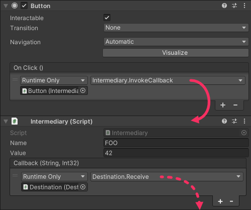

# Workaround for UnityEvent method requirements
There are third-party UnityEvent implementations that support multiple properties. Use one if you are comfortable with the dependency.

A built-in workaround is to serialize the data you want to pass from the UnityEvent in an intermediary.
1. The intermediary script is configured with the serialized data.
1. Your UnityEvent calls a method on the intermediary.
1. The intermediary invokes another UnityEvent which calls the destination with the data. This must use [dynamic values](Dynamic%20Values.md).

## Example
### The destination method
```csharp
using UnityEngine;

public class Destination : MonoBehaviour
{
    public void Receive(string name, int value) => Debug.Log($"{name} called us with {value}!");
}
```
### An intermediary script with data to invoke the above method
I've also provided optional code that will automatically subscribe this script to any `Button` it's added to.  
^^^
```csharp
using UnityEngine;
using UnityEngine.Events;
using UnityEngine.UI;

public class Intermediary : MonoBehaviour
{
	// (1) The serialized data.
	[SerializeField] private string _name;
	[SerializeField] private int _value;

	// A UnityEvent that can be invoked with the above data.
	[SerializeField] private UnityEvent<string, int> _callback;

	// (3) Invoke the UnityEvent with our data.
	public void InvokeCallback() => _callback?.Invoke(_name, _value);

	/* Collapsable: Editor code that subscribes the function to buttons when a new component is created. */
	/// <summary>
	/// Editor code that subscribes the function to buttons when a new component is created.
	/// </summary>
#if UNITY_EDITOR
	private void Reset()
	{
		if (TryGetComponent(out Button button))
			UnityEditor.Events.UnityEventTools.AddPersistentListener(button.onClick, InvokeCallback);
	}
#endif
	/* End Collapsable */
}
```
^^^ ::Replace the data with your own.::{.warning}

#### Inspector setup
^^^

^^^ ::The button calls the Intermediary, which calls the destination with its data.::{.info}
