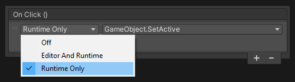

## UnityEvent: States

UnityEvents have a State that defines how the persistent events can be called.  
- Off
- Editor and Runtime
- Runtime Only (default)
### Resolution
Switch the event to **Runtime Only** if you intend to invoke it normally.  
Switch it to **Editor and Runtime** if you're looking to invoke the event in Edit Mode.  

---  

If the UnityEvent is still not invoking, then ensure it is properly called.  
If the UnityEvent resides on a UI component, see [UI - Input Issues](../UGUI/Input%20Issues.md).
