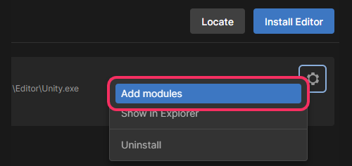

## Unity Hub: Module installation
You must download and install the [Unity hub](https://unity.com/download) to install the a module.

1. [Install a version of the Unity Editor.](Editor%20Installation.md)
1. Navigate to the Installs page in the Unity Hub and click the cog ⚙️ icon on an install.
1. Select **Add Modules**.  
   ^^^
   
   ^^^ Add modules in the Unity Hub
1. Tick the modules you want to install.
1. Select **Install**.