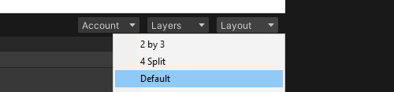
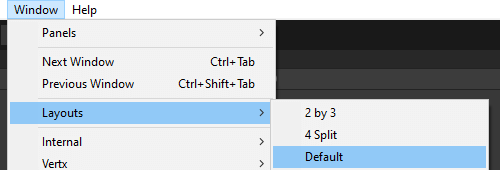

# Resetting layout
Selecting a layout resets the editor windows to match.  
There are two methods to do this.  

The layout dropdown in the top right of the interface **Layout | Default**:    
  

The menu bar via **Window | Layouts | Default**:
  

---

If your problem persists, try restarting Unity.
